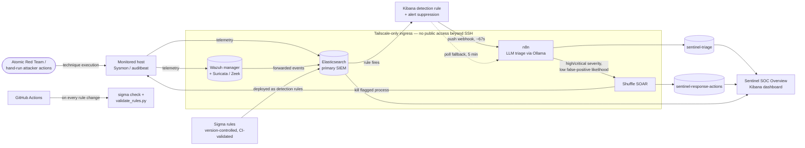

# Sentinel

Security Monitoring & Threat Analysis — the correlation & response brain of a code-driven,
LLM-augmented SOC.

Detections are written once as [Sigma](https://github.com/SigmaHQ/sigma) rules, tagged to
[MITRE ATT&CK](https://attack.mitre.org/), version-controlled, and validated in CI before
being deployed live against [Elastic](https://www.elastic.co/) (the primary running SIEM) —
[Splunk](https://www.splunk.com/) is a secondary Sigma compile target used to prove
portability, not a second thing to operate.

**Standalone-strength test**: detection, correlation, SOAR response, and an LLM triage
pipeline that closes the loop against its own attack emulation — this repo is a complete SOC
on its own, independent of any sibling projects it may sit alongside.

## Architecture

Three OCI VMs, one Terraform config, deployed and reachable only over
[Tailscale](https://tailscale.com/): Elasticsearch + Kibana; Wazuh manager + Suricata/Zeek;
Shuffle SOAR + n8n.

## Detection Coverage

18 Sigma rules (5 Windows, 13 Linux), every one **confirmed firing on live-fired real
commands** — not just checked for valid syntax. ATT&CK coverage spans discovery, execution,
persistence, privilege escalation, defense evasion, credential access, command-and-control,
and exfiltration/impact.

| Detection | Platform | ATT&CK Technique |
|---|---|---|
| LSASS memory dump via `comsvcs.dll` | Windows | [T1003.001](https://attack.mitre.org/techniques/T1003/001/) — OS Credential Dumping |
| Encoded PowerShell execution | Windows | [T1059.001](https://attack.mitre.org/techniques/T1059/001/), [T1027](https://attack.mitre.org/techniques/T1027/) |
| Windows Defender disabled via PowerShell | Windows | [T1562.001](https://attack.mitre.org/techniques/T1562/001/) — Impair Defenses |
| Scheduled task creation via `schtasks.exe` | Windows | [T1053.005](https://attack.mitre.org/techniques/T1053/005/) — Scheduled Task |
| Suspicious `certutil` download/decode | Windows | [T1105](https://attack.mitre.org/techniques/T1105/), [T1140](https://attack.mitre.org/techniques/T1140/) |
| Direct access to `/etc/shadow` | Linux | [T1003.008](https://attack.mitre.org/techniques/T1003/008/) — /etc/passwd and /etc/shadow |
| Cron persistence via direct cron-dir write | Linux | [T1053.003](https://attack.mitre.org/techniques/T1053/003/) — Cron |
| Crontab enumeration | Linux | [T1007](https://attack.mitre.org/techniques/T1007/) — System Service Discovery |
| System network discovery | Linux | [T1016](https://attack.mitre.org/techniques/T1016/) |
| Local system account discovery | Linux | [T1087.001](https://attack.mitre.org/techniques/T1087/001/) |
| Setuid/setgid bit set | Linux | [T1548.001](https://attack.mitre.org/techniques/T1548/001/) — Setuid/Setgid |
| Netcat reverse shell | Linux | [T1059](https://attack.mitre.org/techniques/T1059/) |
| Base64-decode-and-execute | Linux | [T1059.004](https://attack.mitre.org/techniques/T1059/004/), [T1027](https://attack.mitre.org/techniques/T1027/) |
| `curl`/`wget` download-and-execute or piped-to-shell | Linux | [T1105](https://attack.mitre.org/techniques/T1105/) |
| Suspicious curl file upload (exfil) | Linux | [T1567](https://attack.mitre.org/techniques/T1567/), [T1105](https://attack.mitre.org/techniques/T1105/) |
| Shell history deletion | Linux | [T1070.003](https://attack.mitre.org/techniques/T1070/003/) |
| `dd` file overwrite | Linux | [T1485](https://attack.mitre.org/techniques/T1485/) — Data Destruction |
| Sensor container stopped/killed/removed | Linux | [T1562.001](https://attack.mitre.org/techniques/T1562/001/) |

## Validation Methodology

A rule isn't "done" when `sigma check` passes — it's done when it's been fired against and
caught something real:

1. **Windows** — a mix of real replayed attack telemetry ([OTRF
   Mordor](https://github.com/OTRF/detection-container) datasets for LSASS dumping and
   scheduled-task creation) and hand-built synthetic events for techniques with no available
   Mordor sample. The synthetic pass caught and fixed a real `regex~` anchoring bug in the
   encoded-PowerShell rule.
2. **Linux** — every rule validated with genuinely live execution against the monitored host,
   sourced from the official [Atomic Red Team](https://github.com/redcanaryco/atomic-red-team)
   catalog where a Linux test exists, hand-run where it doesn't. This produced this project's
   first real measured MTTD values (**45–151 seconds**) and caught three bugs no amount of
   synthetic testing would have: a rule modeled on a service that doesn't exist on this host's
   actual architecture, and two rules silently broken by `update-alternatives` resolving an
   invoked binary name to a different path than the one being matched.
3. **Every rule has a negative control** — confirmed *not* to fire on benign use of the same
   tool, alongside the positive-fire evidence.
4. **CI** (`sigma check` + `detections/scripts/validate_rules.py`) catches structural
   regressions on every change — file/deployed-id pairing, required fields, and regression
   tests for the two real `regex~` bugs found live-fire testing.

Every rule also carries Kibana alert suppression grouped by `host.name`, collapsing the
"one attacker action, several audit records" duplication found during Linux validation.

## LLM Triage & Automated Response

Two triage pipelines run in parallel against the same self-hosted [Ollama](https://ollama.com/)
model (`llama3.2:3b`), writing to the same index for side-by-side comparison:

- **Push** — a Kibana rule action calls an n8n webhook the instant an alert fires. Measured
  latency (alert fired → triage written): **67 seconds**, almost entirely LLM inference time.
- **Poll** — the original, license-agnostic baseline: an n8n Schedule Trigger sweeping the
  alerts index every 5 minutes, kept running as a fallback that doesn't depend on Elastic's
  paid-tier webhook connector.

When the LLM rates an alert **high/critical severity with low false-positive likelihood**,
n8n calls a Shuffle SOAR workflow that kills the flagged process on the host — bounded to
exactly that one action, and hard-refusing to touch protected system processes regardless of
what it's told. Every response action is logged to `sentinel-response-actions` for the same
auditability as the detection pipeline.

Both the triage output and the response outcomes feed the **Sentinel SOC Overview** Kibana
dashboard: real per-event MTTD trend, alert volume by rule, ATT&CK techniques that have
actually fired, triage severity distribution, and automated-response outcomes — built via
Kibana's saved-objects API and committed as an importable NDJSON bundle, not hand-clicked.

## Deployment Profiles

Two profiles of the same architecture, so it isn't locked to the hardware it was built on:

- **Full** (default) — everything above, running as originally provisioned.
- **Lab** — right-sized for smaller infrastructure, grounded in real `docker stats`
  measurements rather than guesswork. Elasticsearch's heap and Shuffle's bundled OpenSearch
  heap were the two things that actually mattered (roughly two-thirds of a ~3x
  over-provisioning gap measured across all three VMs); everything else already measured
  close enough to sane to leave alone.

Lab sizing is always an explicit opt-in — an env var, an extra `-f` compose file, or
`LAB_MODE=1` — never a silent change to an existing deployment. See
[`docs/deployment-profiles.md`](docs/deployment-profiles.md) for the full numbers.

## Design Decisions

- **One SIEM runs live** (Elastic). Splunk is a Sigma compile target only — this keeps the
  project's story "portable detections," not "installed a lot of tools."
- **Security Onion was dropped** in favor of Suricata + Zeek directly — SO bundles more
  services than this project needs to run per host.
- **Public ingress is minimal**: only SSH (22/tcp) and Tailscale (41641/udp) are open on any
  security list. Kibana, the Wazuh dashboard, Shuffle, and n8n are reached only over Tailscale.
- **Every detection loop closes**: a rule isn't "done" until an attacker technique has fired
  it live and the true/false-positive rate plus time-to-detect is recorded.

## Repo Layout

- `infra/` — Terraform for OCI (VCN, security lists, compute), plus `compose/` (per-VM Docker
  Compose stacks: `elastic/`, `wazuh/`, `soar/n8n/`, `soar/shuffle/`), `elasticsearch/` and
  `kibana/` (index templates and the dashboard, as importable IaC)
- `detections/rules/` — Sigma rules, one per file, each tagged with an ATT&CK technique ID
- `detections/tests/validation.yml` — per-rule validation evidence (Mordor replay, synthetic
  event, or live execution) and measured MTTD
- `detections/scripts/` — Mordor replay, synthetic-event injection, ATT&CK Navigator layer
  generation, and the CI rule-structure validator
- `docs/` — build log (every phase of this project, written as it happened, including the
  dead ends), deployment profiles, ATT&CK coverage
- `scripts/redeploy.sh` — one-command redeploy of the software layer (index templates, all
  rules + actions + suppression, both n8n workflows)

## Status

All three service stacks (Elastic, Wazuh + Suricata/Zeek, Shuffle + n8n) are deployed and
verified live over Tailscale. All 18 Sigma rules are live detection rules with confirmed
real-world fire evidence. The LLM triage pipeline, automated response, and the SOC dashboard
are built and running. Not yet done: a live Atomic Red Team run against a redeployed Windows
target (currently torn down — the Windows side is validated via replay/synthetic events only;
the redeploy path now provisions Sysmon + Winlogbeat, see `docs/build-log.md` Phase 29).
Consolidating the project's three separate search backends (Elasticsearch, Wazuh's indexer,
Shuffle's OpenSearch) was investigated and deliberately rejected — see Phase 29 — since two
of the three are vendor-coupled application datastores, not redundant copies of the same
telemetry.

## Tools & References

| Tool / Standard | Link |
|---|---|
| Sigma | https://github.com/SigmaHQ/sigma |
| Elastic (Elasticsearch + Kibana) | https://www.elastic.co/ |
| Wazuh | https://wazuh.com/ |
| Suricata | https://suricata.io/ |
| Zeek | https://zeek.org/ |
| Shuffle SOAR | https://shuffler.io/ |
| n8n | https://n8n.io/ |
| Ollama | https://ollama.com/ |
| Atomic Red Team | https://github.com/redcanaryco/atomic-red-team |
| OTRF Mordor / Security Datasets | https://github.com/OTRF/detection-container |
| MITRE ATT&CK | https://attack.mitre.org/ |
| Tailscale | https://tailscale.com/ |
| Terraform (OCI provider) | https://registry.terraform.io/providers/oracle/oci/ |
